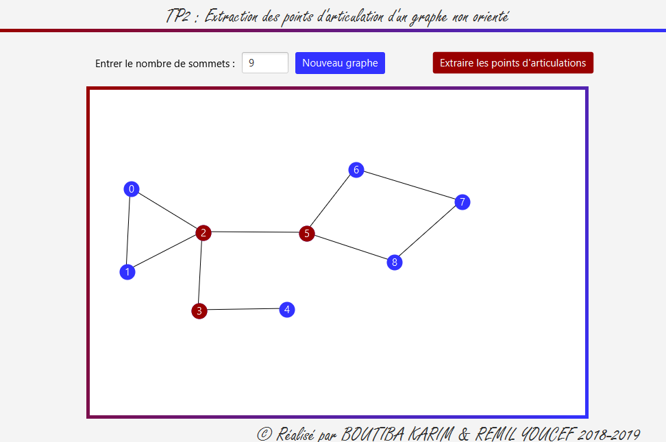

# Problem

An articulation point, also known as a cut vertex, is a vertex in an undirected graph that, if removed along with its incident edges, would increase the number of connected components in the graph. In other words, it is a point in the graph that, when removed, causes the graph to become disconnected or split into multiple connected components.

Given a graph, we aim to extract all its articulation points

# DFS-based algorithm

1. Initialize a counter variable to keep track of the number of children of each vertex visited in the DFS traversal.
2. Initialize an array visited to keep track of visited vertices and set all entries to False.
3. Initialize an array low to keep track of the lowest vertex reachable from each vertex in the DFS traversal, and set all entries to infinity.
4. Initialize an array parent to keep track of the parent vertex of each vertex in the DFS traversal, and set the parent of the root vertex to -1.
5. For each unvisited vertex in the graph, perform a DFS traversal from that vertex using the following recursive function

```
def dfs(v):
    visited[v] = True
    low[v] = v
    is_articulation = False
    child_count = 0
    for neighbor in adj_list[v]:
        if not visited[neighbor]:
            parent[neighbor] = v
            child_count += 1
            dfs(neighbor)
            low[v] = min(low[v], low[neighbor])
            if parent[v] == -1 and child_count > 1:
                is_articulation = True
            elif parent[v] != -1 and low[neighbor] >= v:
                is_articulation = True
        elif neighbor != parent[v]:
            low[v] = min(low[v], neighbor)
    if is_articulation:
        print("Vertex", v, "is an articulation point")
        
```


# A JavaFX software tool

